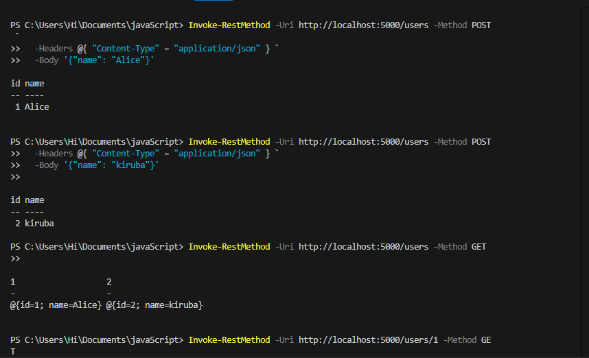
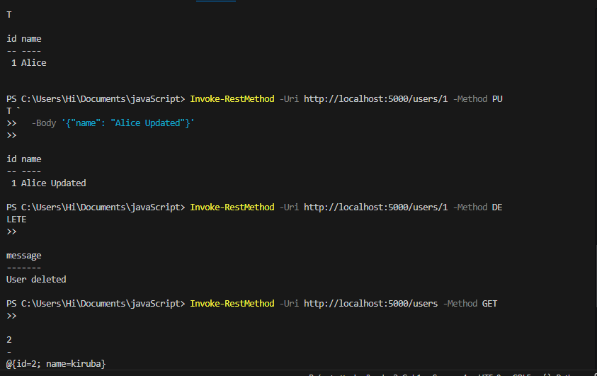

 Task4-build-a-rest-API-with-flask
 🧪 Flask REST API - User Management

A simple RESTful API built using Python and Flask to perform CRUD operations on users stored in memory.

---

 📸 Demo
 ---------

🚀 Flask Running
-----------------


📬 Postman Test
----------------





---

 📂 Project Structure
 ----------------------

flask-user-api/
│
├── main.py # Main Flask app
├── README.md # Project readme
└── images/ # Screenshots
├── flask-running.png
└── postman-test.png


---
 🛠️ Tech Stack
 --------------
- Python 3.13
- Flask 3.x
- Postman or cURL

---

📦 Installation
------------------

1. Clone the repo:
    ```bash
    git clone https://github.com/your-repo/flask-user-api.git
    cd flask-user-api
    ```

2. (Optional) Create a virtual environment:
    ```bash
    python -m venv venv
    venv\Scripts\activate
    ```

3. Install Flask:
    ```bash
    pip install flask
    ```

---
▶️ Run the Application
-----------------------

```bash
python main.py
App will be running at:
http://127.0.0.1:5000

📬 API Endpoints
------------------
Method	Endpoint	Description
GET	/users	List all users
GET	/users/<id>	Get user by ID
POST	/users	Create new user
PUT	/users/<id>	Update existing user
DELETE	/users/<id>	Delete user

🧪 Example (PowerShell)
-------------------------
powershell
Copy
Edit
Invoke-RestMethod -Uri http://localhost:5000/users -Method POST `
  -Headers @{ "Content-Type" = "application/json" } `
  -Body '{"name": "Alice"}'

Invoke-RestMethod -Uri http://localhost:5000/users -Method GET
Invoke-RestMethod -Uri http://localhost:5000/users/1 -Method GET

Invoke-RestMethod -Uri http://localhost:5000/users/1 -Method PUT `
  -Headers @{ "Content-Type" = "application/json" } `
  -Body '{"name": "Alice Updated"}'

Invoke-RestMethod -Uri http://localhost:5000/users/1 -Method DELETE

📎 Notes
-----------
Data is stored in memory; it resets on restart.

Use for learning/testing only.

📚 License
------------
MIT

---

🖼️ Don't Have Screenshots Yet?

Take them by:

- Opening the browser at `http://localhost:5000/users`
- Testing in Postman
- Saving terminal showing Flask running

Save those as:

- `images/flask-running.png`
- `images/postman-test.png`

--
